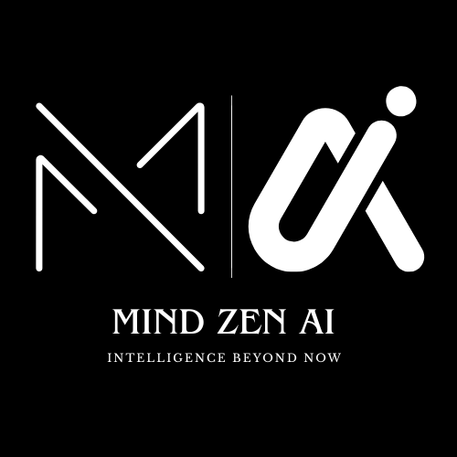
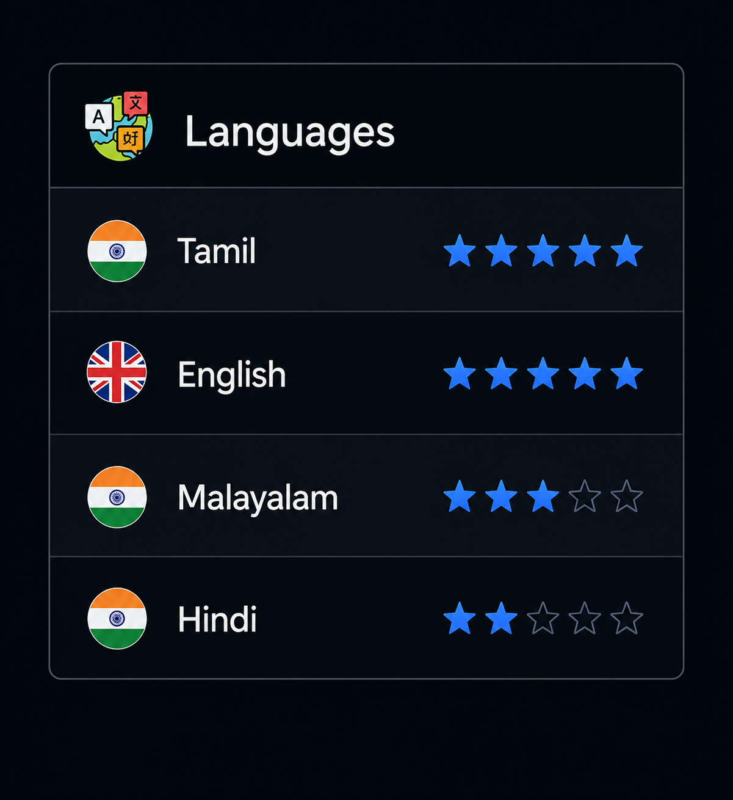

<div align="center">
  
</div>

<h1 align="center">👋 Hi, I'm Sharukh Sameer</h1>

<h3 align="center">
AI Engineer • Python Developer • Machine Learning Enthusiast
</h3>

<p align="center">
Building intelligent AI-powered applications with Machine Learning,
Computer Vision, Automation and Full Stack Development.
</p>

<br>

<p align="center">
<a href="YOUR_PORTFOLIO_LINK">

</a>

<a href="https://www.linkedin.com/in/sharukhsameer">

</a>

<a href="mailto:sharukhsameer2005@gmail.com">

</a>

</p>

</div>
---
<div align="center">

<table border="1" cellspacing="0" cellpadding="15">

<tr>

<td align="center" width="110">

</td>

<td align="center">
<h2>Founder & CEO • MindZen AI</h2>
</td>

<td align="center" width="110">

</td>

</tr>

<tr>

<td colspan="3" align="center">

<i>
"Most people fear failure. Entrepreneurs turn it into fuel."
</i>

</td>

</tr>

</table>

<br>

<h3>Building Intelligence Beyond Now</h3>

<p align="center">

Empowering the future through <b>Artificial Intelligence</b>,
<b>Machine Learning</b>, <b>Automation</b>,<br>

and <b>Full-Stack Engineering</b>.

</p>

</div>

## ABOUT ME
<table width="100%" border="0" cellspacing="0" cellpadding="10">

<tr>

<td width="65%" valign="top">

<pre><code><b>👤 Name </b>         : M A Sharukh Sameer
<b>💼 Role</b>         : AI/ML Engineer in Training • Full-Stack + Web3 Builder
<b>🎓 Degree</b>       : B.Tech Artificial Intelligence & Data Science (2024–2028)
<b>🏫 University</b>   : KGiSL Institute of Technology
<b>📍 Location</b>     : Coimbatore, Tamil Nadu, India
<b>🚀 Startup</b>      : Founder & CEO • MindZen AI

<b>💼 Experience</b>
   • AI/ML Intern — Initz Technology
   • Full Stack Developer Intern — SSM Drilling Academy

</code></pre>

</td>

<td width="35%" align="center" valign="top">



</td>

</tr>

</table>

I'm an **AI & Data Science undergraduate** who ships real, working products instead of just tutorials — from an AI-driven stock analysis platform to a Web3-based learning/manpower portal. I care about the full pipeline: data → model → clean UI → deployed product, with a strong product-engineering mindset rather than just "notebook code."

Currently sharpening my edge across **machine learning, applied AI automation, blockchain/Solidity, and prompt engineering**, while contributing to hackathons and internships that force me to ship under real constraints.

**🎯 Open To:**
- AI/ML Engineer Internships & New-Grad roles
- Full-Stack Developer roles with an AI/automation angle
- Blockchain / Web3 development opportunities
- Freelance AI automation & N8N workflow builds
- Open-source collaboration

<br/>

---

## TECH STACK

<p align="center">


</p>
---

## 🤖 AI / ML Expertise

<div align="center">

| Domain | Proficiency | Details |
|---|:---:|---|
| **Machine Learning & Deep Learning** | ⭐⭐⭐⭐☆ | Model building, training pipelines, evaluation for applied use-cases |
| **AI Automation** | ⭐⭐⭐⭐☆ | Workflow automation using n8n + custom AI logic |
| **Prompt Engineering** | ⭐⭐⭐⭐⭐ | Designing structured prompts for reasoning, generation & agentic flows |
| **Computer Vision (Applied)** | ⭐⭐⭐☆☆ | Facial recognition & emotion detection (AI Virtual Companion project) |
| **Blockchain / Web3 AI Hybrid Systems** | ⭐⭐⭐☆☆ | Combining smart contracts with AI-driven decisioning |
| **Data Analysis** | ⭐⭐⭐⭐☆ | Real-time market data processing for financial insight generation |

</div>

<br/>

---

## 🚀 Featured Projects

<details open>
<summary><b>📈 ProfitPulse — AI-Powered Stock Analysis Platform</b></summary>
<br/>

An AI-driven platform that analyzes real-time market data and turns it into **beginner-friendly investment guidance**, so new investors don't need to decode raw financial data themselves.

| Attribute | Detail |
|---|---|
| **Stack** | Python, AI/ML models, real-time data feeds |
| **Scale** | Individual retail investors |
| **Performance** | Real-time market data ingestion |
| **Security** | Read-only market data, no funds custody |
| **Impact** | Simplifies investment decisions for beginners |
| **Repository** | `github.com/SHARUKH2005` *(link project repo here)* |

Built to bridge the gap between raw financial data and actionable, easy-to-understand guidance for first-time investors.

</details>

<details>
<summary><b>🛢️ SSM Drilling Portal — Manpower Consultancy Platform</b></summary>
<br/>

A full manpower consultancy platform built for a drilling operations company, featuring job postings, candidate management, and **AI-based job analysis** to match candidates to roles faster.

| Attribute | Detail |
|---|---|
| **Stack** | Web platform + AI job-matching logic |
| **Scale** | Enterprise recruitment (SSM Drilling Academy) |
| **Performance** | Streamlined candidate → job pipeline |
| **Security** | Role-based access for recruiters/candidates |
| **Impact** | Reduced manual screening effort in recruitment |
| **Repository** | `github.com/SHARUKH2005` *(link project repo here)* |

Delivered during an internship, combining real recruitment workflows with AI-assisted candidate-job matching.

</details>

<details>
<summary><b>🧩 AI Web Platform — Intelligent Job Matching + Resume Generator (Ongoing)</b></summary>
<br/>

An AI-powered job matching system paired with an **intelligent resume generator**, designed to help candidates get matched to relevant openings and auto-build tailored resumes.

| Attribute | Detail |
|---|---|
| **Stack** | Python, AI/NLP, web frontend |
| **Scale** | Job seekers & recruiters |
| **Performance** | In active development |
| **Security** | User data handled per standard auth practices |
| **Impact** | Speeds up job discovery & resume creation |
| **Repository** | `github.com/SHARUKH2005` *(link project repo here)* |

</details>

<details>
<summary><b>🎭 AI Virtual Companion — Facial Recognition + Emotion Detection (Ongoing)</b></summary>
<br/>

An AI assistant capable of **facial recognition, emotion detection, and interactive communication**, aimed at building a more human, responsive AI companion experience.

| Attribute | Detail |
|---|---|
| **Stack** | Computer Vision, Python, AI models |
| **Scale** | Individual user interaction |
| **Performance** | In active development |
| **Security** | Local/consent-based facial data processing |
| **Impact** | Explores emotionally-aware AI interaction |
| **Repository** | `github.com/SHARUKH2005` *(link project repo here)* |

</details>

<details>
<summary><b>🏆 PyExpo'25 Python Hackathon — Team PyNnovators</b></summary>
<br/>

Built an AI-based solution under time pressure as part of **Team PyNnovators**, which resulted in an internship opportunity.

| Attribute | Detail |
|---|---|
| **Stack** | Python, AI/ML |
| **Scale** | Hackathon team project |
| **Performance** | Delivered within hackathon time constraints |
| **Security** | N/A — prototype build |
| **Impact** | Shortlisted for internship opportunities |
| **Repository** | `github.com/SHARUKH2005` *(link project repo here)* |

</details>

<br/>

---

## 💼 Experience

<table>
<tr>
<td>

**AI Developer Trainee** · Initz Technologies
`Trainee Role`

Developed AI-based solutions and assisted in machine learning projects, performing data analysis and collaborating across the AI application development lifecycle.

**Scope of Work:**
- Assisted in building and testing ML models
- Performed data analysis to support AI application decisions
- Collaborated cross-functionally on AI feature development

`Python` `Machine Learning` `Data Analysis` `AI Development`

</td>
</tr>
<tr>
<td>

**Intern** · SSM Drilling Academy
`Internship`

Assisted in recruitment, training, and AI-driven automation initiatives, while supporting digital platform development and technical documentation.

**Scope of Work:**
- Supported AI-driven automation for recruitment workflows
- Contributed to digital platform development
- Authored technical documentation for training modules

`AI Automation` `Recruitment Tech` `Documentation` `Digital Platforms`

</td>
</tr>
<tr>
<td>

**Python Hackathon Participant** · Team PyNnovators
`PyExpo'25`

Built an AI-based solution in a team environment under hackathon constraints, demonstrating programming, teamwork, and problem-solving skills.

**Scope of Work:**
- Collaborated in a team to design & build an AI solution
- Delivered a working prototype under time pressure
- Shortlisted for an internship opportunity as a result

`Python` `Teamwork` `Rapid Prototyping` `Problem Solving`

</td>
</tr>
</table>

<br/>

---

## 🏅 Achievements

<div align="center">

| Recognition | Details |
|---|---|
| 🏆 Internship Offer — PyExpo'25 | Earned an internship opportunity via Team PyNnovators' hackathon solution |
| 🤝 AI Developer Trainee | Selected as an AI Developer Trainee at Initz Technologies |
| 🛢️ Completed Internship | Successfully completed internship at SSM Drilling Academy |

</div>

<br/>

---

## 📊 GitHub Analytics

<div align="center">


<br/>


</div>

<br/>

---

## ACTIVITY

<p align="center">
  
</p>

---

## 🎯 Current Focus

```yaml
learning:
  - Advanced Deep Learning architectures
  - Solidity smart contract security
  - Agentic AI systems & tool-use workflows

building:
  - AI-powered job matching platform with intelligent resume generation
  - AI Virtual Companion with facial recognition & emotion detection

exploring:
  - n8n-based AI automation pipelines
  - Web3 + AI hybrid applications

open_to:
  - AI/ML Internships
  - Full-Stack + AI roles
  - Blockchain/Web3 collaborations
```

<br/>

---

<div align="center">

*"Discipline today. Success tomorrow."*

</div>
